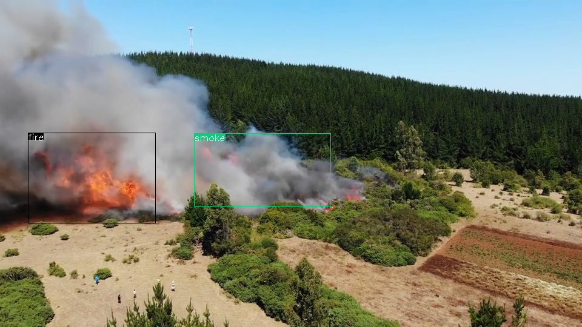

# aiBox

[English version](README_EN.md)
## 介绍
使用 RK3588 NPU 部署 目标检测、跌倒检测、火焰和烟雾检测案例。

## 目录
``` bash
aiBox/
├── build.sh            编译脚本
├── CMakeLists.txt      
├── include
├── lib
├── model               模型目录
├── README.md
├── sort
├── sources             推理 Demo MP4
└── src
```

## 使用说明

### 编译
```bash
# 需要安装依赖
sudo apt update && sudo apt install -y build-essential cmake libopencv-dev libjsoncpp-dev

# 编译后会将可执行文件放在 install 目录下【注:】代码中推理使用的模型文件需要填写实际的路径
# const std::string modelPath = "/home/mixtile/aiBox/model/";
# const std::string modelPathPerDet = modelPath + "perdet.rknn";
# const std::string modelPathPerAttr = modelPath + "perattr.rknn";
# const std::string modelPathFallDet = modelPath + "falldet.rknn";
# const std::string modelPathFireSmokeDet = modelPath + "firesmoke.rknn";

在工程目录下执行 ./build.sh

aiBox/install/
├── aibox               可执行文件
├── lib
└── model
```

### 使用案例
#### People Detection
```bash
# 测试 People 检测,可以在显示器看到视频画面
./aibox ../sources/people.mp4

# 生成结果保存在 output 目录下
aiBox/install/output/           检测结果目录
├── falldet
├── firesmokedet
├── perdet                      人检测结果目录
│   ├── 20241025101821.png      推理结果图片
│   ├── 20241025101821.txt      推理结果 Json 文件
    ......
│   ├── 20241025101825.png
│   └── 20241025101825.txt
└── result                      所有推理结果总和目录
    ├── 20241025101821.png      多模型结果输出图
    ├── 20241025101821.txt      多模型结果 Json 文件
     ......
    ├── 20241025101825.png
    └── 20241025101825.txt

``` 


```bash
# Json 格式数据
{
	"RegionCoun" : 6,
	"frameID" : 60,
	"personDetections" : 
	[
		{
			"height" : 80.156204223632812,
			"id" : 1,
			"width" : 44.384883880615234,
			"x" : 578.4610595703125,
			"y" : 373.16336059570312
		},
		{
			"height" : 96.03472900390625,
			"id" : 2,
			"width" : 50.4891357421875,
			"x" : 783.239013671875,
			"y" : 350.9332275390625
		},
.......
		{
			"height" : 70.822250366210938,
			"id" : 42,
			"width" : 40.765220642089844,
			"x" : 515.832763671875,
			"y" : 456.24789428710938
		}
	]
}
```

#### People Falldown Detection
```bash
# 测试 People 检测,可以在显示器看到视频画面
./aibox ../sources/falldown.mp4

# 生成结果保存在 output 目录下
aiBox/install/output/
├── falldet                     跌倒检测结果目录
│   ├── 20241025102557.png
│   ├── 20241025102557.txt
    ......
│   ├── 20241025102605.png
│   └── 20241025102605.txt
├── firesmokedet
├── perdet
│   ├── 20241025102548.png
│   ├── 20241025102548.txt
    ......
│   ├── 20241025102605.png
│   └── 20241025102605.txt
└── result
    ├── 20241025102548.png
    ├── 20241025102548.txt
    ......
    ├── 20241025102605.png
    └── 20241025102605.txt

```


```bash
# Json 格式数据
{
	"RegionCoun" : 1,
	"fallDetections" : 
	[
		{
			"height" : 265.0,
			"id" : 0,
			"width" : 417.0,
			"x" : 78.0,
			"y" : 246.0
		}
	],
	"fireSmokeDetections" : 
	[
		{
			"height" : 89.0,
			"id" : "fire",
			"width" : 33.0,
			"x" : 647.0,
			"y" : 162.0
		}
	],
	"frameID" : 354,
	"personDetections" : 
	[
		{
			"height" : 217.73216247558594,
			"id" : 1,
			"width" : 390.02099609375,
			"x" : 83.897674560546875,
			"y" : 289.94583129882812
		}
	]
}
```

#### Flame and Smoke Detection
```bash
# 测试 People 检测,可以在显示器看到视频画面
./aibox ../sources/fire.mp4

# 生成结果保存在 output 目录下
aiBox/install/output/
├── falldet
├── firesmokedet                火焰烟雾检测结果目录
│   ├── 20241025102859.png
│   ├── 20241025102859.txt
    ......
│   ├── 20241025102902.png
│   └── 20241025102902.txt
├── perdet
└── result
    ├── 20241025102859.png
    ├── 20241025102859.txt
    ......
    ├── 20241025102902.png
    └── 20241025102902.txt

``` 


```bash
# Json 格式数据
{
	"fireSmokeDetections" : 
	[
		{
			"height" : 133.0,
			"id" : "fire",
			"width" : 165.0,
			"x" : 119.0,
			"y" : 233.0
		},
		{
			"height" : 131.0,
			"id" : "smoke",
			"width" : 246.0,
			"x" : 324.0,
			"y" : 222.0
		}
	],
	"frameID" : 114
}
```

## 流程：
                          **主线程**
           从摄像头读取帧 -> 分配给模型线程池

                           模型线程
               PerDet infer()  |  PerAttr infer()  |  FallDet infer()  |  FireSmokeDet infer()

                         **结果处理线程**
          接收推理结果 -> 结果叠加 -> 输出显示

