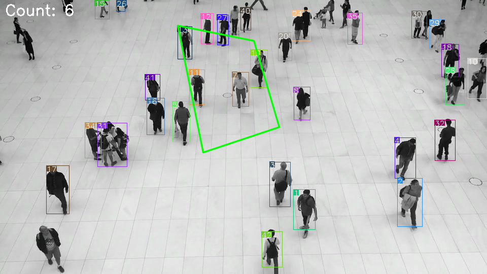
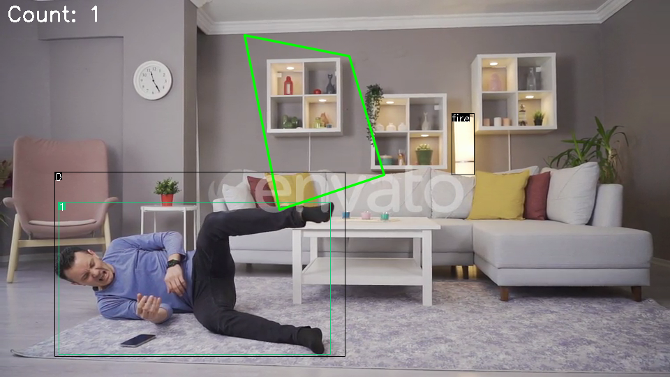
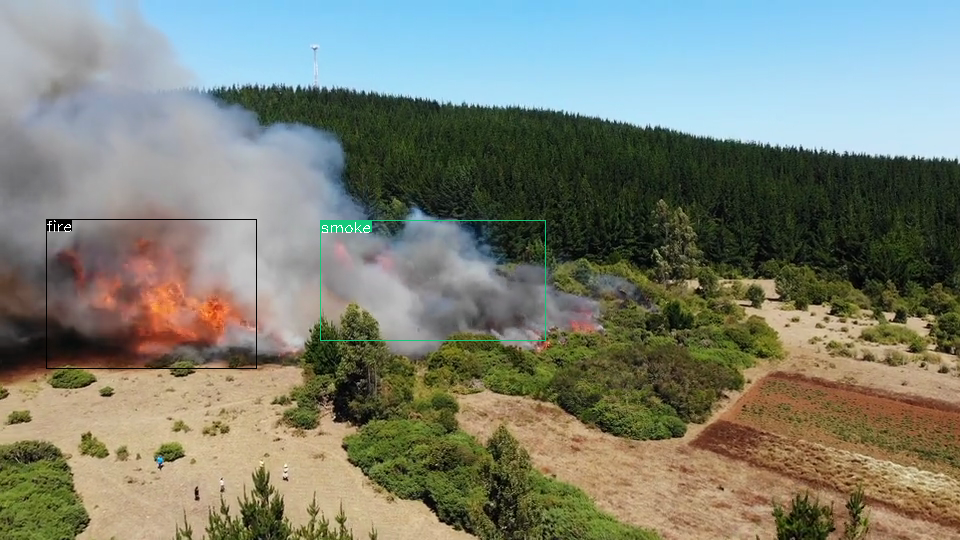

# aiBox

[中文版本](README.md)
## Introduction
Deploy target detection, fall detection, flame, and smoke detection using the RK3588 NPU.

## Directory
``` bash
aiBox/
├── build.sh            Build script
├── CMakeLists.txt      
├── include
├── lib
├── model               Model directory
├── README.md
├── sort
├── sources             Inference Demo MP4
└── src
```

## Instructions
### Compilation
```bash

# Install dependencies
sudo apt update && sudo apt install -y build-essential cmake libopencv-dev libjsoncpp-dev

# After compiling, the executable file will be placed in the install directory.
# [Note:] The model file path needs to be specified in the code for inference:
# const std::string modelPath = "/home/mixtile/aiBox/model/";
# const std::string modelPathPerDet = modelPath + "perdet.rknn";
# const std::string modelPathPerAttr = modelPath + "perattr.rknn";
# const std::string modelPathFallDet = modelPath + "falldet.rknn";
# const std::string modelPathFireSmokeDet = modelPath + "firesmoke.rknn";

Run ./build.sh in the project directory.

aiBox/install/
├── aibox               Executable file
├── lib
└── model
```

## Usage Examples
### People Detection

```bash

# Test People Detection. Video output can be viewed on the screen
./aibox ../sources/people.mp4

# Results will be saved in the output directory
aiBox/install/output/           Detection result directory
├── falldet
├── firesmokedet
├── perdet                      People detection results
│   ├── 20241025101821.png      Inference result image
│   ├── 20241025101821.txt      Inference result JSON file
    ......
│   ├── 20241025101825.png
│   └── 20241025101825.txt
└── result                      Combined inference results
    ├── 20241025101821.png      Multi-model result image
    ├── 20241025101821.txt      Multi-model result JSON file
     ......
    ├── 20241025101825.png
    └── 20241025101825.txt
```

```bash
# Json 格式数据
{
	"RegionCoun" : 6,
	"frameID" : 60,
	"personDetections" : 
	[
		{
			"height" : 80.156204223632812,
			"id" : 1,
			"width" : 44.384883880615234,
			"x" : 578.4610595703125,
			"y" : 373.16336059570312
		},
		{
			"height" : 96.03472900390625,
			"id" : 2,
			"width" : 50.4891357421875,
			"x" : 783.239013671875,
			"y" : 350.9332275390625
		},
.......
		{
			"height" : 70.822250366210938,
			"id" : 42,
			"width" : 40.765220642089844,
			"x" : 515.832763671875,
			"y" : 456.24789428710938
		}
	]
}
```

### People Falldown Detection

```bash

# Test People Detection. Video output can be viewed on the screen
./aibox ../sources/falldown.mp4

# Results will be saved in the output directory
aiBox/install/output/
├── falldet                     Falldown detection results
│   ├── 20241025102557.png
│   ├── 20241025102557.txt
    ......
│   ├── 20241025102605.png
│   └── 20241025102605.txt
├── firesmokedet
├── perdet
│   ├── 20241025102548.png
│   ├── 20241025102548.txt
    ......
│   ├── 20241025102605.png
│   └── 20241025102605.txt
└── result
    ├── 20241025102548.png
    ├── 20241025102548.txt
    ......
    ├── 20241025102605.png
    └── 20241025102605.txt
```


```bash
# Json 格式数据
{
	"RegionCoun" : 1,
	"fallDetections" : 
	[
		{
			"height" : 265.0,
			"id" : 0,
			"width" : 417.0,
			"x" : 78.0,
			"y" : 246.0
		}
	],
	"fireSmokeDetections" : 
	[
		{
			"height" : 89.0,
			"id" : "fire",
			"width" : 33.0,
			"x" : 647.0,
			"y" : 162.0
		}
	],
	"frameID" : 354,
	"personDetections" : 
	[
		{
			"height" : 217.73216247558594,
			"id" : 1,
			"width" : 390.02099609375,
			"x" : 83.897674560546875,
			"y" : 289.94583129882812
		}
	]
}
```

### Flame and Smoke Detection

```bash
# Test Flame and Smoke Detection. Video output can be viewed on the screen
./aibox ../sources/fire.mp4

# Results will be saved in the output directory
aiBox/install/output/
├── falldet
├── firesmokedet                Flame and Smoke Detection results
│   ├── 20241025102859.png
│   ├── 20241025102859.txt
    ......
│   ├── 20241025102902.png
│   └── 20241025102902.txt
├── perdet
└── result
    ├── 20241025102859.png
    ├── 20241025102859.txt
    ......
    ├── 20241025102902.png
    └── 20241025102902.txt
```


```bash
# Json 格式数据
{
	"fireSmokeDetections" : 
	[
		{
			"height" : 133.0,
			"id" : "fire",
			"width" : 165.0,
			"x" : 119.0,
			"y" : 233.0
		},
		{
			"height" : 131.0,
			"id" : "smoke",
			"width" : 246.0,
			"x" : 324.0,
			"y" : 222.0
		}
	],
	"frameID" : 114
}
```

## Process
```scss
        Main Thread Capture frames from camera -> Assign to model thread pool

                       Model Threads
           PerDet infer()  |  PerAttr infer()  |  FallDet infer()  |  FireSmokeDet infer()

                     **Result Processing Thread**
      Receive inference results -> Overlay results -> Display output
```
